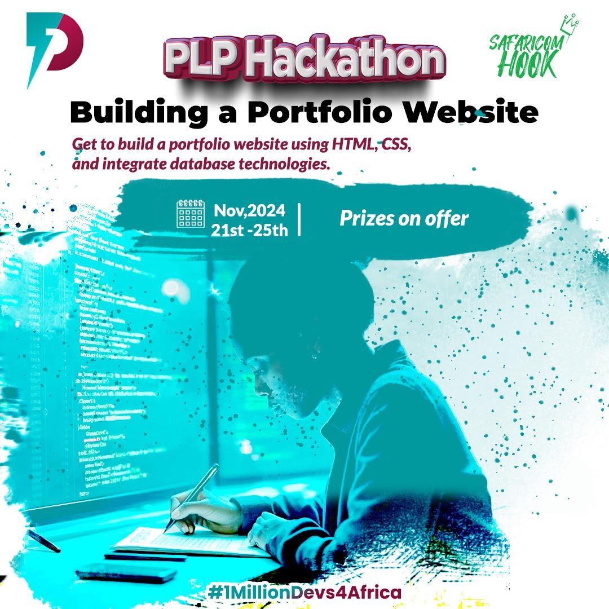

# PLP-Peer-To-Peer--Group-18

## Team Project Repository
Welcome to our team’s project repository! Here you can find information about our group, the projects we’ve worked on, and our accomplishments.

## Group Members

1. **Lewis manyasa**
2. **Marklewis mutugi**
3. **Betty Mukami**
4. **Patel Hadaisa**
5. **Ivy Chelang'a**
6. **Veronica Wendy**
7. **Ahmed Adan**
8. **Cassandra Mghoi Mwawasi**
9. **Arnold Kiprotich**

## Group Members' Name and Project

| Name             | GitHub Link                              | Demo Link                         |
|------------------|------------------------------------------|------------------------------------|
| Lewis Manyasa    | [GitHub](https://github.com/kinglui2/my-personal-website-portfolio-Group-18.git) | [Portfolio](https://kinglui2.github.io/my-personal-website-portfolio-Group-18/) |
| Marklewis mutugi        | [GitHub](https://github.com/lewiii254/Marklewis-portfolio-group-18)     | [Portfolio](https://lewiii254.github.io/Marklewis-portfolio-group-18/) |
| Betty Mukami    | [GitHub](https://github.com/Bettylmm/myportfolio-group18.git) | [Portfolio](https://github.com/Bettylmm/myportfolio-group18.git) |
| Patel Hadaisa     | [GitHub](https://github.com/PatelFamily21/patelfamily21.github.io)  | [Portfolio](http://patelfamily21.github.io) |
| Ivy Chelang'a     | [Github](https://github.com/IvyG111/Portfolio.git)  | [Portfolio](https://github.com/IvyG111/Portfolio.git) |
| Veronica Wendy     | [GitHub](https://github.com/V4Me-star/hackathon-1.git)  | [Portfolio](https://github.com/V4Me-star/hackathon-1.git) |
| Ahmed Adan     | [GitHub](https://github.com/Noor3600/SafaricomHookHackathon1-Group18.git)  | [Portfolio](https://github.com/Noor3600/SafaricomHookHackathon1-Group18.git) |
| Cassandra Mghoi Mwawasi | [GitHub](https://github.com/Ceemghoi/Portolio.git)  | [Portfolio](https://github.com/Ceemghoi/Portolio.git) |
| Arnold Kiprotich | https://github.com/arnold792/portfolio.git |https://portfolio-git-main-arnoldkiprotich50-gmailcoms-projects.vercel.app/  |

---

## Completed Tasks

Each of us was tasked with building a personal portfolio website. Here’s what we all achieved:  
- Created a user-friendly and responsive design.  
- Showcased personal projects, skills, and educational background.  
- Added interactive elements such as contact forms and live demos.  

---
## Acknowledgment

We would like to extend our gratitude to **[PLP Academy]** for providing us with the opportunity and resources to complete this project. Their support and structured guidance played a significant role in helping us develop our skills and successfully build our portfolio websites.

We also thank our peers and instructors for fostering a collaborative and inspiring learning environment.

---

## How to Explore the Projects
1. Click on the **Portfolio Website** links above to view the live sites.
2. Check out the code in the respective GitHub repositories (linked on the websites).

---

### **Why This Task Matters**
This project allowed us to:  
- Demonstrate our web development skills in HTML, CSS, and JavaScript.  
- Learn to structure and design a portfolio for showcasing our work.  
- Collaborate as a group while maintaining individual creativity.
